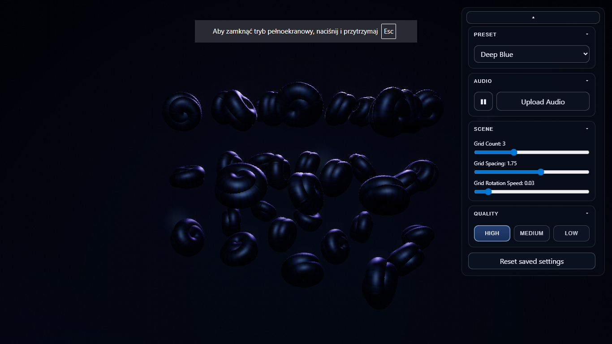
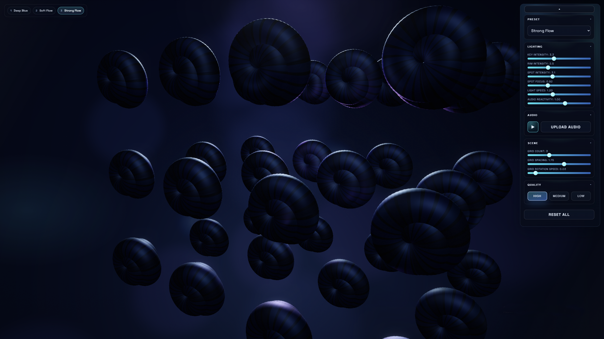
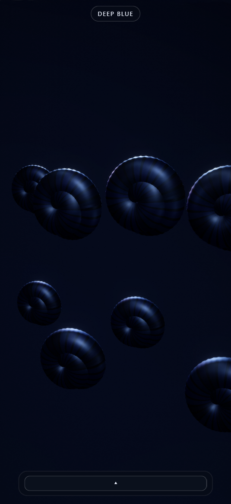

<!-- Mini banner (static) -->

  

  
    Three.js · InstancedMesh · Bloom/Fog · Audio-reactive lighting · Shader injection
  

---

## Artist Statement

A field of toroidal forms becomes a study of repetition and controlled variation.  
Light defines structure, while audio modulates intensity and rhythm.  
Bloom and fog dissolve geometry into atmosphere.  
Each preset reveals a different spatial mood.  
The system balances precision and motion — structure and energy.

---

## 🎬 Full Video Preview (MP4 – High Quality)

  <a href="https://github.com/nataliaans78-lang/Generative-Torus-Sculpture/releases/latest/download/GLS_optimized.mp4">
    ▶ Download Full MP4 Preview
  </a>

---

## Preview (GIF)

  

---

## Presets

  

  

  

---

## Mobile UI

  

---

## Tech Stack

- Three.js
- WebGL
- InstancedMesh
- Custom shader injection
- Audio-reactive light modulation
- Post-processing (Bloom, Fog)

---

## Project Type

Experimental generative WebGL sculpture exploring light, repetition and spatial rhythm.  
Created as an artistic + technical exploration of procedural form and atmosphere.
