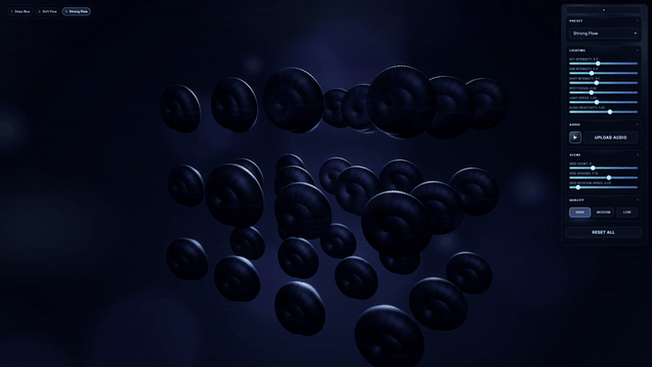
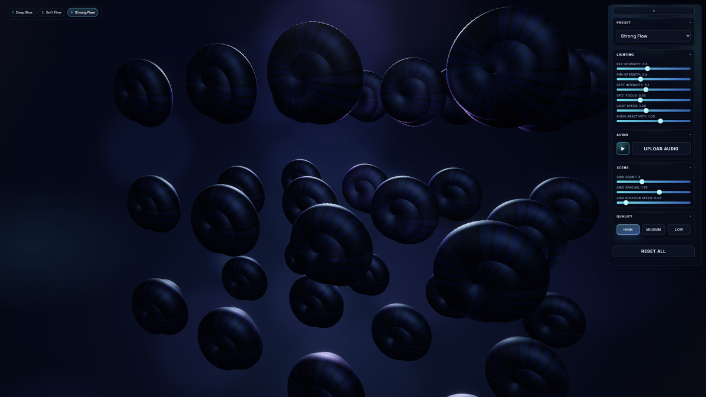
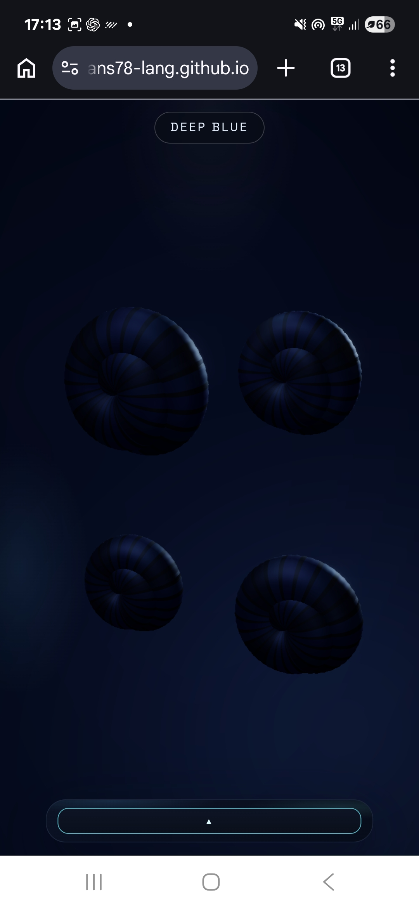

<p align="center">
  
</p>

<p align="center">
  <sub>Three.js · InstancedMesh · Bloom/Fog · Audio-reactive lighting · Shader injection</sub>
</p>

---

## Overview
Interactive WebGL experiment combining instanced geometry, audio-reactive lighting, and post-processing to create dynamic light sculptures.  
Designed as a real-time visual system balancing performance, responsiveness, and atmospheric rendering.

---

## Artist Statement
A field of toroidal forms becomes a study of repetition and controlled variation.  
Light defines structure, audio modulates intensity and rhythm.  
Bloom and fog dissolve geometry into atmosphere.  
Each preset reveals a distinct spatial mood.  
The system balances precision and motion — structure and energy.

---

## Live Demo
- Page: https://nataliaans78-lang.github.io/Generative-Torus-Sculpture/  
- Full MP4 preview: https://github.com/nataliaans78-lang/Generative-Torus-Sculpture/releases/latest/download/GLS_optimized.mp4  

---

## Local Development

```bash
npm ci
npm run dev
npm run build
```

---

## Preview (GIF)
<p align="center">
  
</p>

---

## Presets
- **Deep Blue** — static, gallery-like; lights are non–audio-reactive, minimal torus motion  
- **Flow Soft** — soft, dark, audio-reactive without overexposure  
- **Flow Strong** — dynamic and punchy while remaining controlled  

<p align="center">
  
</p>

---

## Controls
- Move the mouse or use touch to interact with the sculpture
- **Space** — play or pause audio
- **H** — hide or show the controls
- **R** — reset the experience
- **1 / 2 / 3** — switch between presets

---

## Performance
- Adaptive quality system based on runtime performance  
- Adaptive DPR / pixel ratio with synchronized WebGLRenderer and EffectComposer output
- Automatic adjustment of geometry density and rendering resolution  
- Stable frame pacing across different devices  
- Mobile-specific geometry, pixel ratio, and interaction optimizations

---

## Mobile
- Reduced geometry complexity and pixel ratio for smoother performance  
- Centered and simplified control panel  
- Preserved interaction behaviour with reduced detail  

<p align="center">
  
</p>

---

## Tech Stack
- Three.js / WebGL  
- InstancedMesh  
- Custom shader injection  
- Audio-reactive light modulation  
- Post-processing: Bloom, Fog  

---

## Accessibility
- Collapsed controls are removed from keyboard navigation
- Control states are exposed through ARIA attributes
- Keyboard shortcuts ignore active form fields

---

## Audio
- Supports local audio file uploads for reactive playback
- Rapid file changes are guarded against stale loading results
- Temporary object URLs are released after loading completes

---

## Repository Notes
Build artifacts are not tracked. Deploy output is generated by the build process.

---

## Project Type
Experimental generative WebGL sculpture exploring light, repetition, and spatial rhythm.  
Created as both an artistic and technical exploration of procedural form and atmosphere.
